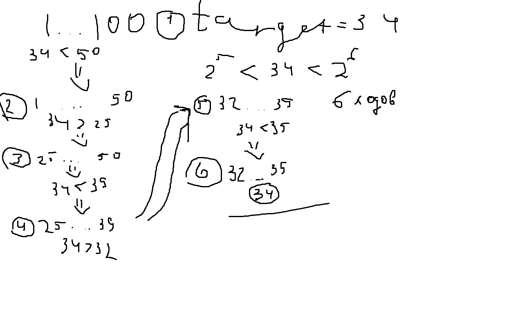
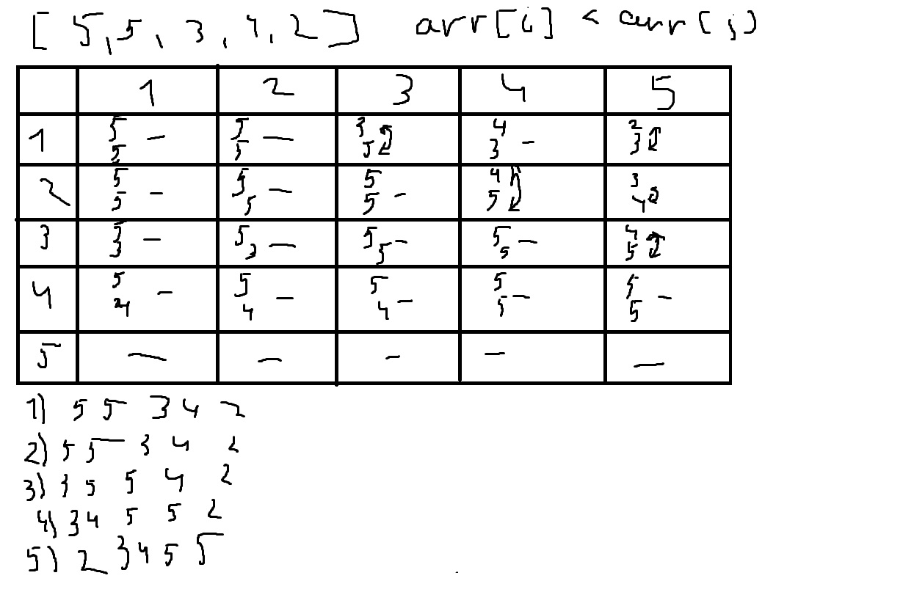

```
system("chcp 65001");
setlocale(LC_ALL, "ru_RU.UTF-8");
```

## Ввод-вывод быстрый

Для быстрого ввода и вывода в C++ стоит добавить
в проект 

```
std::ios_base::sync_with_stdio(false);
std::cin.tie(0);
```

Для многострочного ввода можно использовать функцию

```
std::getline(std::cin, s);
```

## Бинарный поиск

Алгоритм O(log n)

Позволяет найти число в диапазоне с большой скоростью, делением списка элементов
пополам

Описание с картинкой


```C++
std::tuple<int, bool> binarySearchByNum(int l, int r, int t) {
    int m;
    int steps = 0;
    while (l < r) {
        steps++;
        m = (l + r) / 2;
        std::cout << "l = " << l << " r = " << r << " t = " << t << std::endl;
        if (m == t) {
            return std::make_tuple(steps, true);
        } else if (m < t) {
            l = m + 1;
        } else {
            r = m - 1;
        }
    }
    return std::make_tuple(steps, false);
```

```C++
l = 1 r = 100 t = 76
l = 51 r = 100 t = 76
l = 76 r = 100 t = 76
l = 76 r = 87 t = 76
l = 76 r = 80 t = 76
l = 76 r = 77 t = 76
Steps = 6 was found = 1
```

Также бинарным поиском можно пройтись по массиву с данными, суть такая же как с диапазоном, но
используется отсортированный массив
```C++
int binarySearch(int *arr, int len, int target) {
    int left = 0;
    int right = len-1;

    while (left <= right) {
        int mid = (left + right) / 2;

        if (arr[mid] == target) {
            return mid;
        } else if (arr[mid] > target) {
            right = mid - 1;
        } else {
            left = mid + 1;
        }
    }

    return -1;
}
```

В ```<algorithm>``` в *C++* есть функции 
```C++
upper_bound(arr.begin(), arr.end(), target);
lower_bound(arr.begin(), arr.end(), target);
```

Которые выдают результаты<br>
**upper_bound** - **число** > **target**<br>
**--upper_bound** - **число** <= **target**<br>
**lower_bound** - **число** >= **target**<br>
**--lower_bound** - **число** < **target**

```C++
target = 34 arr: {1, 7, 20, 34, 81, 192, 847, 994, 4444, 10000}
lower_bound: 34 --lower_bound: 20
upper_bound: 81 --upper_bound: 34
target = 33 arr: {1, 7, 20, 34, 81, 192, 847, 994, 4444, 10000}
lower_bound: 34 --lower_bound: 20
upper_bound: 34 --upper_bound: 20
target = 25 arr: {1, 7, 20, 34, 81, 192, 847, 994, 4444, 10000}
lower_bound: 34 --lower_bound: 20
upper_bound: 34 --upper_bound: 20
target = 81 arr: {1, 7, 20, 34, 81, 192, 847, 994, 4444, 10000}
lower_bound: 81 --lower_bound: 34
upper_bound: 192 --upper_bound: 81
```

Бинарный поиск для вещественных чисел работает чуть сложнее, тк
вещественные числа ПК считает неточно

```Python
print(0.1+0.1+0.1) #0.30000000000000004
```

Поэтому нужно предполагать сколько итераций примерно займет такая-то операция<br>
(log 10 ~ 3)<br>
(log 32 = 5)<br>
Но чтобы не думать каждый раз об этом, можно сказать, что 100 шагов бинарного поиска будет достаточно

```C++
float sqrtBinSearch(float x) {
    float l = 0, r = x;
    for (int i = 0; i < 100; i++) {
        float m = (l + r) / 2;
        if (m * m < x) {
            l = m;
        } else {
            r = m;
        }
    }
    return l;
}
```

```C++
sqrt 2 = 1.41421
sqrt 34 = 5.83095
sqrt 9 = 3
```

## Сортировка

### Сортировка пузырьком

Алгоритм O(n²)

Алгоритм проходит по массиву, 
меняю элементы (меньший и больший) местами,
от начала и до конца в двух циклах

Описание с картинкой


```C++
void bubbleSort(int *arr, int n) {
    int temp;
    for (int i = 0; i < n; i++) {
        for (int j = 0; j < n-1; j++) {
            if (arr[i] < arr[j]) {
                temp = arr[i];
                arr[i] = arr[j];
                arr[j] = temp;
            }
        }
    }
}
```

Логи:
```C++
i = 0 j = 0 arr[i] = 5 arr[j] = 5
i = 0 j = 1 arr[i] = 5 arr[j] = 5
i = 0 j = 2 arr[i] = 5 arr[j] = 3
i = 0 j = 3 arr[i] = 5 arr[j] = 4
i = 1 j = 0 arr[i] = 5 arr[j] = 5
i = 1 j = 1 arr[i] = 5 arr[j] = 5
i = 1 j = 2 arr[i] = 5 arr[j] = 3
i = 1 j = 3 arr[i] = 5 arr[j] = 4
i = 2 j = 0 arr[i] = 3 arr[j] = 5
Change: i = 2 j = 0 arr[i] = 5 arr[j] = 3
i = 2 j = 1 arr[i] = 5 arr[j] = 5
i = 2 j = 2 arr[i] = 5 arr[j] = 5
i = 2 j = 3 arr[i] = 5 arr[j] = 4
i = 3 j = 0 arr[i] = 4 arr[j] = 3
i = 3 j = 1 arr[i] = 4 arr[j] = 5
Change: i = 3 j = 1 arr[i] = 5 arr[j] = 4
i = 3 j = 2 arr[i] = 5 arr[j] = 5
i = 3 j = 3 arr[i] = 5 arr[j] = 5
i = 4 j = 0 arr[i] = 2 arr[j] = 3
Change: i = 4 j = 0 arr[i] = 3 arr[j] = 2
i = 4 j = 1 arr[i] = 3 arr[j] = 4
Change: i = 4 j = 1 arr[i] = 4 arr[j] = 3
i = 4 j = 2 arr[i] = 4 arr[j] = 5
Change: i = 4 j = 2 arr[i] = 5 arr[j] = 4
i = 4 j = 3 arr[i] = 5 arr[j] = 5
```

Было:
```C++
5 5 3 4 2
```

Результат:
```C++
2 3 4 5 5
```

### Сортировка выбором

